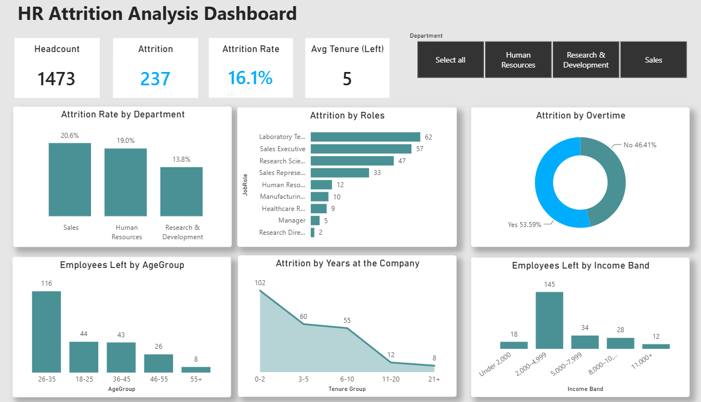

# 📊 HR Attrition Analysis Dashboard

## 📌 Project Overview

This project presents an interactive HR analytics dashboard built in Power BI to explore employee attrition patterns and identify factors associated with employee turnover.

The dashboard transforms insights discovered during the Python exploratory analysis into an interactive reporting solution that allows users to monitor key HR metrics and explore attrition trends.

---

## 🎯 Business Problem

Employee attrition can result in increased hiring costs, loss of experienced employees, and operational challenges.

The HR department needs visibility into employee turnover patterns to identify areas with higher attrition risk and support workforce retention strategies.

---

## 🎯 Objectives

- Create an interactive HR analytics dashboard.
- Track key employee attrition KPIs.
- Analyse turnover patterns across departments and employee characteristics.
- Identify groups with higher attrition levels.
- Provide clear insights to support HR decision-making.

---

## 📂 Dataset

**Dataset:** IBM HR Analytics Employee Attrition & Performance

The dataset contains information on **1,470 employees**, including:

- Employee demographics
- Department
- Job role
- Monthly income
- Overtime
- Years at company
- Attrition status

---

## 🛠 Tools & Technologies

- Power BI Desktop
- Power Query
- DAX
- Data visualisation

---

## 📈 Dashboard Features

### KPI Cards

- 👥 Total Employees
- 🚪 Employees Left
- 📉 Attrition Rate
- ⏳ Average Tenure of Employees Who Left

### Visualisations

- 📊 Attrition Rate by Department
- 🕒 Attrition by Overtime
- 👥 Employees Left by Age Group
- 💼 Employees Left by Job Role
- 💰 Employees Left by Income Band
- 📈 Attrition by Years at Company

### Interactive Features

- 🎛 Department slicer for dynamic filtering

---

## 🧮 DAX Measures

The dashboard includes custom DAX measures including:

- Employees Left
- Attrition Rate
- Average Tenure of Leavers
- Monthly Income Analysis
  

---

## 💡 Key Findings

- **Overall attrition rate:** 16.1%.

- **Department:** Sales has the highest attrition rate among departments.

- **Age:** Employees aged 26–35 represent the largest group of employees leaving the company.

- **Tenure:** Employees in the early years of employment show the highest attrition levels.

- **Overtime:** Employees working overtime show higher turnover levels.

---

## 🔗 Related Project

The Power BI dashboard was developed after completing the Python exploratory analysis of the same HR dataset.

➡️ [HR Attrition Analysis with Python](https://www.example.com](https://github.com/YuliaGrinenko/HR-Attrition-Data-Analysis-Python))
